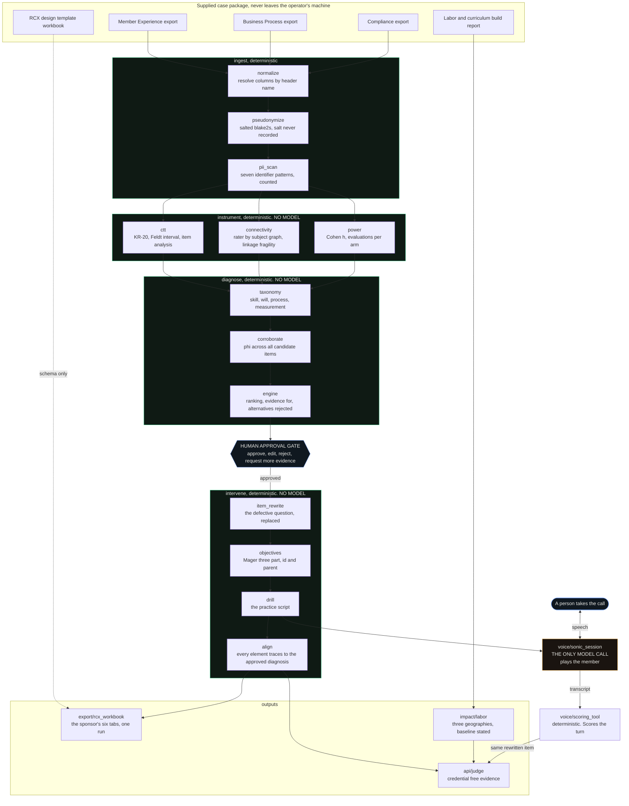
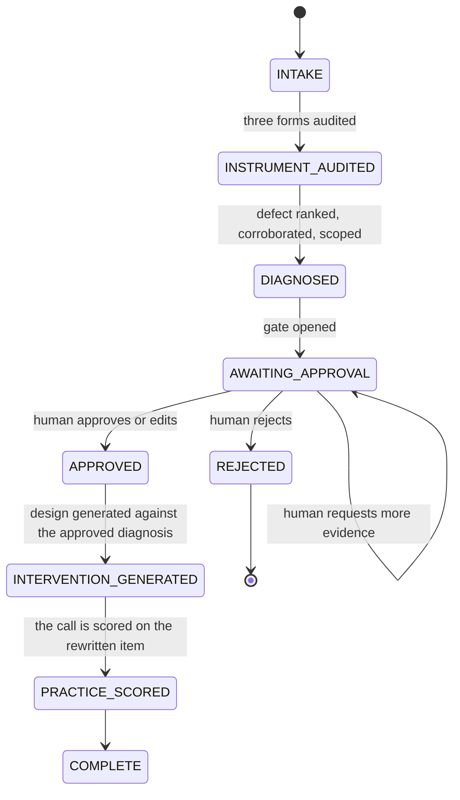

# How CALIPER is built, and where a human decides

Two diagrams. The first is the agent. The second is the run state machine, which
is where the human sits.

Every module named below exists in the tree, and the claim that only one of them
talks to a language model is enforced by `tests/test_no_model_in_the_core.py`
rather than described here and hoped for.

## The agent

The shape of that picture is the argument. Everything that produces a number, a
verdict, a dollar figure or a piece of training content is in a green box. The
single amber box is a synthetic member talking. Nothing flows from amber back
into a number.

## Where a human decides

**The gate is not a disclaimer, it is a state.** Nothing downstream of it can run
until a human has moved the run out of `AWAITING_APPROVAL`, and the alignment
validator fails any generated element that does not trace back to a diagnosis in
`APPROVED`. Kill the process at the gate and restart it: the run resumes from the
approved state, because the decision is in the store and not in a variable.

Four actions rather than two, because approve or not is not how a reviewer
actually thinks:

| Action | What it means | What happens |
|---|---|---|
| `APPROVE` | the diagnosis is right | design generation unlocks |
| `EDIT` | right defect, wrong wording or scope | unlocks, with the edit recorded |
| `REJECT` | wrong diagnosis | the run ends, and nothing is generated |
| `REQUEST_MORE_EVIDENCE` | not enough to decide | the gate stays shut |

Every transition is appended to a ledger with the actor, the note, and
`actor_verified`, which records whether the name attached to the decision was
authenticated or merely typed. A run where nobody was authenticated is still a
valid run; it just says so.

## The second human interaction

The practice call. A person speaks, the model plays the member, and the turn is
scored **in code** against the rewritten quality item the audit produced, not by
the speech model. The same instrument that produced the diagnosis scores the
practice, which is what makes the loop closed rather than merely sequential.

## What the diagram deliberately does not show

There is no arrow from a model into a number, because there is no such path. The
diagnosis narrative, the training objectives, the activity, the drill script, the
six workbook tabs and every dollar figure are templates filled from computed
values. An earlier version of the README claimed a model narrated evidence into
prose and drafted intervention content. Neither was ever built, the package that
would have held them was empty and imported nowhere, and the claim has been
corrected to what ships.
