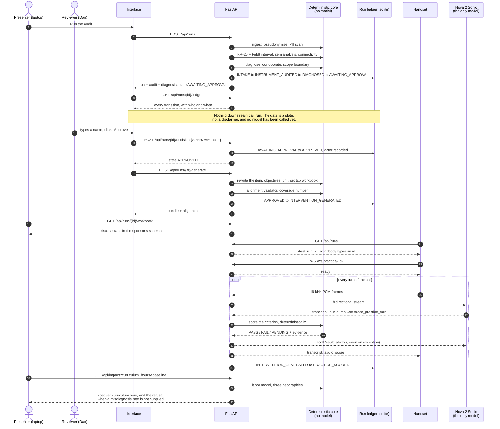

# The run, as a sequence

One run, end to end, in the order the calls actually happen. Every arrow below
was read off `frontend/src/lib/api.ts`, `caliper/api/main.py` and
`caliper/orchestrator/run_state.py`, and watched on the wire against the
deployed origin, so this is the shipped sequence rather than the intended one.

The thing to notice is where the model appears: once, inside the practice call,
after a human has already approved. Nothing upstream of the gate can call it,
and nothing it says becomes a number.



## The same thing for websequencediagrams.com

Paste this at <https://www.websequencediagrams.com>.

```
title CALIPER: one run, end to end

Presenter->Interface: Run the audit
Interface->API: POST /api/runs
API->Core (no model): ingest, pseudonymise, PII scan
API->Core (no model): KR-20 + Feldt interval, item analysis, connectivity
API->Core (no model): diagnose, corroborate, scope boundary
API->Ledger: INTAKE -> INSTRUMENT_AUDITED -> DIAGNOSED -> AWAITING_APPROVAL
API-->Interface: audit + diagnosis, state AWAITING_APPROVAL
Interface->API: GET /api/runs/{id}/ledger
API-->Interface: every transition, with who and when

note over Interface, Ledger: The gate is a state, not a disclaimer.\nNo model has been called yet.

Reviewer->Interface: types a name, clicks Approve
Interface->API: POST /api/runs/{id}/decision {APPROVE, actor}
API->Ledger: AWAITING_APPROVAL -> APPROVED, actor recorded
API-->Interface: state APPROVED

Interface->API: POST /api/runs/{id}/generate
API->Core (no model): item rewrite, objectives, drill, six tab workbook
API->Core (no model): alignment validator, coverage
API->Ledger: APPROVED -> INTERVENTION_GENERATED
API-->Interface: bundle + alignment
Presenter->API: GET /api/runs/{id}/workbook
API-->Presenter: .xlsx, six tabs in the sponsor's schema

Handset->API: GET /api/runs
API-->Handset: latest_run_id
Handset->API: WS /ws/practice/{id}
API-->Handset: ready

loop every turn of the call
Handset->API: 16 kHz PCM frames
API->Nova 2 Sonic: bidirectional stream
Nova 2 Sonic-->API: transcript, audio, toolUse score_practice_turn
API->Core (no model): score the criterion
Core (no model)-->API: PASS / FAIL / PENDING + evidence
API-->Nova 2 Sonic: toolResult, always, even on exception
API-->Handset: transcript, audio, score
end

API->Ledger: INTERVENTION_GENERATED -> PRACTICE_SCORED
Presenter->API: GET /api/impact
API->Core (no model): labor model, three geographies
API-->Presenter: cost per curriculum hour
```

## What the diagram is arguing

**One model call, and it is downstream of a human.** `Nova 2 Sonic` appears in
exactly one band, inside the practice call, after `APPROVED` is already in the
ledger. Every box marked no model is ordinary Python, and
`tests/test_no_model_in_the_core.py` fails the build if a second module ever
imports a model SDK.

**The model never produces a number.** It returns a transcript and a tool call.
The criterion is scored by `caliper/voice/scoring_tool.py`, and the result of
that scoring is what reaches the screen.

**Every state change is written before it is acted on.** Kill the process at any
arrow and the run resumes from the last recorded state, which is the difference
between a gate and a disclaimer.
